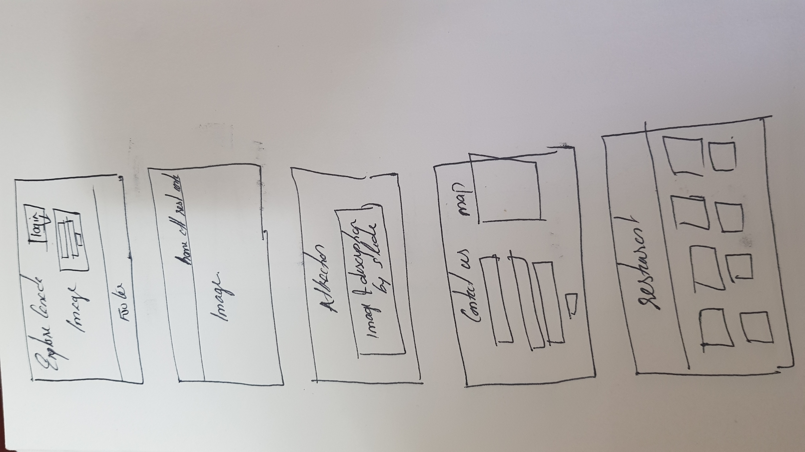

# EXPLORE CANADA
   ## UX ##
* This website is for travelers who wish to explore Canada.
* This website gives them an idea about two main categories every traveler wants to know about ie main attractions and food destinations
* We provide free travel advisory and guidence for those who register in our website and those who want to reach out directly has been provoded with our map location
### USER STORIES ###
* As an admin i wish to give an on stop destination for tourist to Canada.
* As a user i can register and avail free travel advisory services.
* As a User i can get information about the places i wish to visit.
*  As a user i can explore the various food culture and by clicking the link it will redirect to the orginal restaurant page which i can book a table and make prior reservations.
 * As a user i can raise my queries to travel experts.
 
 #### WIREFRAMES ####
 

## FEATURES ##
In this section, you should go over the different parts of your project, and describe each in a sentence or so.
### Existing Features###
* Application for website login.
* Navigation to home page.
* Navigation to attraction page.
* Navigation to Restaurant page.
* Navigation to Contact page.
* Redirection link to restaurant webpages.
* Direction Map.
* Provided Contact Us form.
* Slide show of tourist attractions and brief description about destination.
* Provide Login form.

### Features Left to Implement ###
* Options to provide customer reviews about destinations.
* New webpage for Accomodation/Hotels information
 * Application form for Accomodation preferences.
  * Option to provide hotel review
* New webpage for various travel modes and options including car rental details and public bus timings.
 
 ## Technologies Used ##
 * **HTML** is used for the creation of webpage.
 * **CSS** is used for website design and Styling.
 * **IFRAME** is used for incorperating location map in the website.
 * **Font Awesome** is used for taking icons.
 * **BOOTSRAP 4** to have reusable CSS styling.
 
 ## TESTING ##
 * All the html and css code has been tested in **w3c validator**.
 * Test has been performed to login credential requirement for website login.
 * Test has been done to verify all the href links are working properly.
 * Test was done for slideshow of images on attraction page.
 * Test has been done if the form is working properly.
 * Test has been done to ensure proper working of website in various devices.
 * Test has been done to ensure proper working of location map.
 
 ### Project looks and screen sizes ###
 
* The website is designed with bootstrap hence mobile friendly by default.
* Different Screen sizes are available for different devices
  eg: ipad pro: 1024 x 1336
  
## Deployment ##
This section should describe the process you went through to deploy the project to a hosting platform (e.g. GitHub Pages or Heroku).

In particular, you should provide all details of the differences between the deployed version and the development version, if any, including:

Different values for environment variables (Heroku Config Vars)?
Different configuration files?
Separate git branch?
In addition, if it is not obvious, you should also describe how to run your code locally.

## Credits ##
### Content ###
* The text for attraction section was copied from the Wikipedia article important tourist attractions
* The text for login section was copied from the Wikipedia article canada.

## Media ##
* The photos used in this site were obtained from google images related to canada.

## Acknowledgement ##
* I received inspiration for this project from various travel websites.
  
 
 
 

